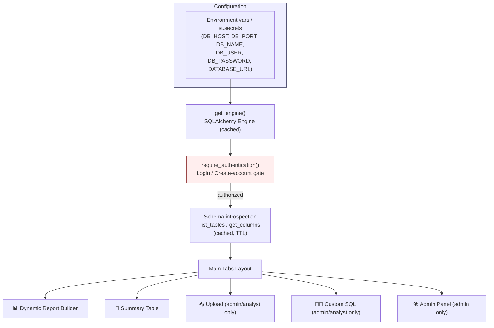
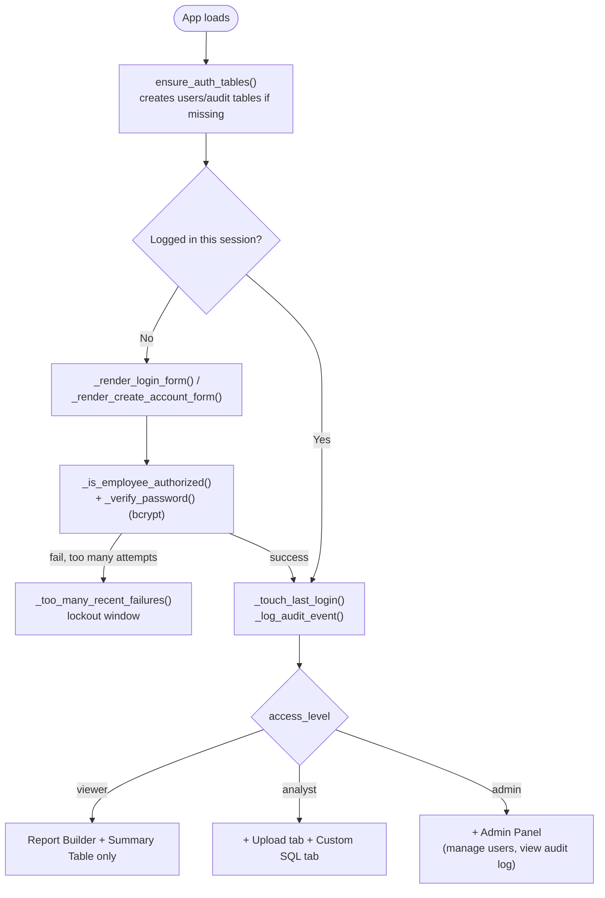
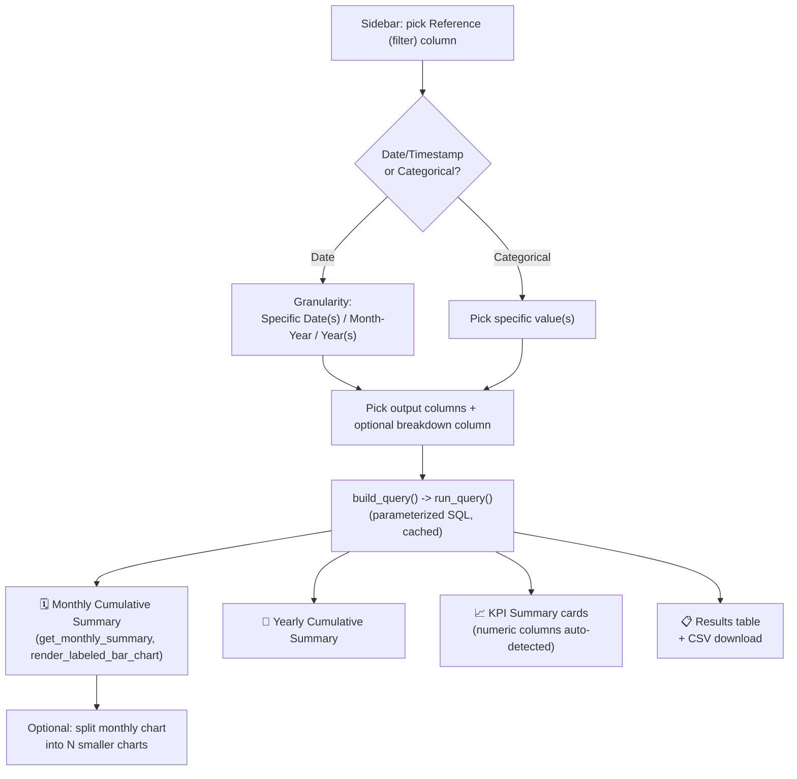
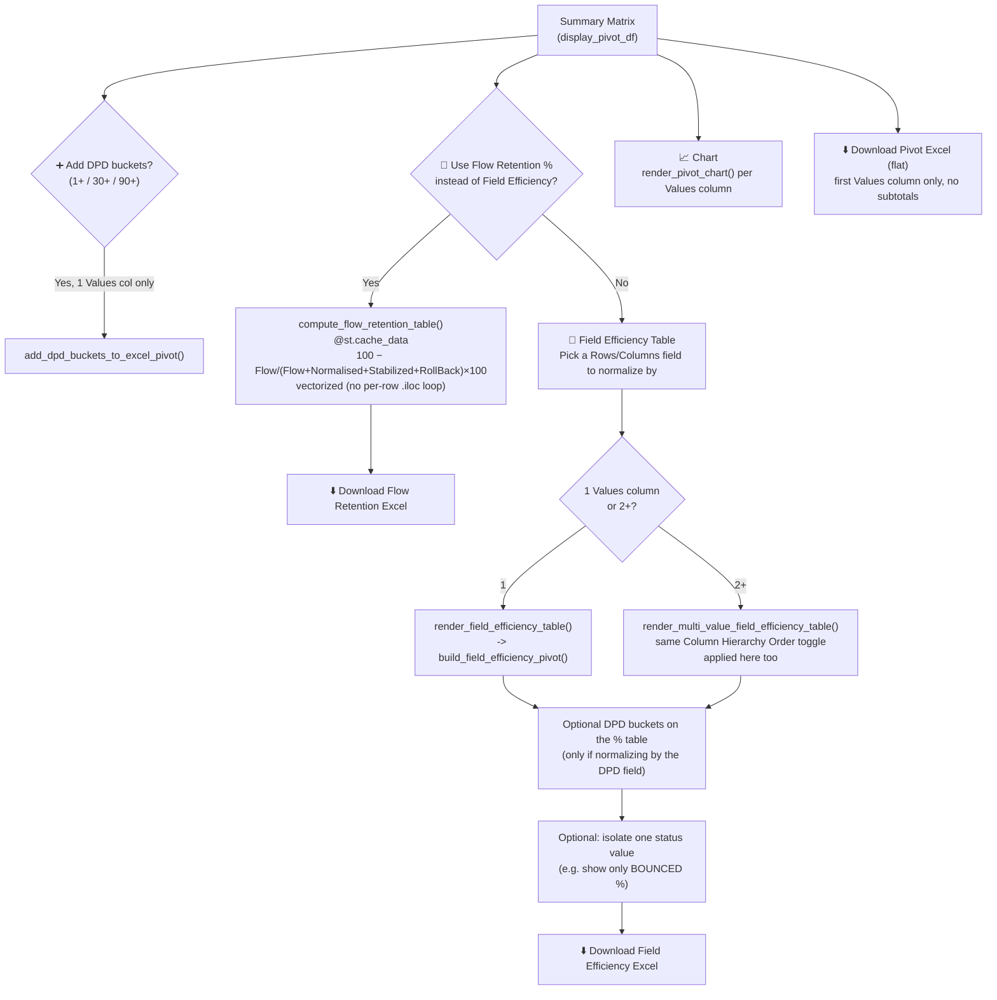

# Dynamic PostgreSQL Explorer & Report Generator

A single-file Streamlit application (`app.py`) that lets a user pick any
table in a PostgreSQL database, filter it, and build reports against it in
two different ways: a **Dynamic Report Builder** (date/category filters +
KPI cards + charts) and a **Summary Table** (a full Excel-style PivotTable
engine with subtotals, Field Efficiency %, Flow Retention %, and Excel
export). Authentication, an admin panel, and a raw-file-upload-to-DB tool
are also built in.

---

## 1. High-Level Architecture



---

## 2. Authentication & Access Control



---

## 3. Tab 1 — Dynamic Report Builder



---

## 4. Tab 2 — Summary Table (the PivotTable Engine)

### 4.1 Building the pivot

```mermaid
flowchart TB
    SEL["Sidebar: pick Rows, Columns,\nValues (1+), Aggregation func,\nFilters, Crores toggle,\nRight-Total mode,\nColumn Hierarchy Order"] --> GUARD{"Estimated row count\ntoo large?"}
    GUARD -->|Yes| WARN["⚠️ Warning + 'Render anyway' button\n(prevents freezing the browser)"]
    GUARD -->|No| FETCH["fetch_pivot_source_data()\npre-aggregates in SQL:\nSTAT_SUM / STAT_COUNT / STAT_MIN / STAT_MAX\nper unique Rows × Columns combo\n(cached @st.cache_data)"]
    WARN -->|clicked| FETCH

    FETCH --> ONEVAL{"1 Values column\nor 2+?"}
    ONEVAL -->|1| SINGLE["render_excel_style_pivot_table()\n-> build_excel_style_pivot()"]
    ONEVAL -->|2+| MULTI["render_multi_value_pivot_table()\n-> build_excel_style_pivot() per Values column,\nthen combined side by side"]

    SINGLE --> ROWTREE
    MULTI --> ROWTREE

    subgraph ROWTREE["Row tree construction"]
        RT1["_build_row_entries()\nvectorized: rank + sort + single pass\n(no per-node table rescans)"]
    end

    ROWTREE --> COLTREE["_build_col_entries()\nsame subtotal/leaf pattern for Columns"]
    COLTREE --> HIER{"Column Hierarchy Order\n(2+ Values cols only)"}
    HIER -->|Values -> Columns\n(default)| LAYOUT1["Sum of Mar | Sum of Aug | Sum of Sep\n  STAGE_1 STAGE_2 STAGE_3   (nested)"]
    HIER -->|Columns -> Values\n(swapped)| LAYOUT2["STAGE_1 | STAGE_2 | STAGE_3\n  Mar Aug Sep   (nested)"]

    LAYOUT1 --> RENDER["_render_styled_pivot_matrix()\non-screen styled table"]
    LAYOUT2 --> RENDER
    RENDER --> DL1["⬇️ Download Summary Matrix Excel\n(dataframe_to_formatted_excel_bytes,\n@st.cache_data)"]
```

### 4.2 Downstream views built from the Summary Matrix



---

## 5. Caching Strategy

All expensive steps are wrapped in `@st.cache_data(ttl=...)` so that
Streamlit's "rerun the whole script on any interaction" model doesn't
repeat heavy work on unrelated clicks:

| Function | Cached? | Why |
|---|---|---|
| `get_engine()` | `@st.cache_resource` | one DB engine per process |
| `list_tables`, `get_columns` | `@st.cache_data` | schema rarely changes |
| `fetch_pivot_source_data()` | `@st.cache_data` | the expensive SQL aggregation |
| `build_excel_style_pivot()` | `@st.cache_data` | reused across DPD/Flow/export calls |
| `build_field_efficiency_pivot()` | `@st.cache_data` | same reasoning |
| `compute_flow_retention_table()` | `@st.cache_data` | avoids recompute on unrelated reruns |
| `dataframe_to_formatted_excel_bytes()` | `@st.cache_data` | avoids rebuilding openpyxl workbooks (styled cell-by-cell) on every rerun, even when the download button isn't clicked |

---

## 6. Key Performance Notes (things already fixed in this codebase)

- **`_build_row_entries`** used to recursively re-scan the *entire* source
  table with a fresh boolean mask at every hierarchy node — with a deep
  Rows hierarchy and tens of thousands of leaf groups, this could freeze
  the browser entirely. It now ranks each level once, sorts the distinct
  row combinations by those ranks, and walks the sorted table in a single
  linear pass — the exact same tree, built in roughly O(n log n) instead
  of O(nodes × table size).
- **`_compute_flow_retention_from_rows`** used to loop row-by-row with
  `.iloc[i]`; it's now vectorized with pandas boolean masks and DataFrame
  arithmetic.
- **Month ordering** (`_month_sort_key`) sorts chronologically,
  January → December, ascending by year — used everywhere a
  month-like text column drives row/column order.
- **`dataframe_to_formatted_excel_bytes`** is cached so the 4 separate
  Excel-export call sites across the page don't rebuild a styled workbook
  on every unrelated rerun.

---

## 7. Other Tabs

- **📥 Upload** (`render_upload_tab`) — lets an analyst/admin upload a
  CSV/Excel file, clean/dedupe its column names, and load it into a new or
  existing Postgres table (`process_uploaded_workbook`).
- **🧑‍💻 Custom SQL** — a free-text `SELECT`-only query box (admin/analyst
  only) with a CSV download of the result.
- **🛠️ Admin Panel** (`render_admin_panel`) — manage user accounts and
  view the audit log (login attempts, account creation, etc.).

---

## 8. File Map (single file, by section)

```
app.py
├─ Page config & environment/config helpers
├─ Database engine (cached)
├─ Schema introspection (list_tables, get_columns, classify_column)
├─ Formatting helpers (Crores, monthly/yearly summary, charts)
├─ Query builder (build_query, run_query)
├─ Pivot source data (fetch_pivot_source_data, _combine_group_stats,
│   _make_dims_cache, _lookup_dims_value, _ordered_unique/_month_sort_key)
├─ Excel-style pivot engine (_build_row_entries, _build_col_entries,
│   build_excel_style_pivot, render_excel_style_pivot_table,
│   render_multi_value_pivot_table, add_dpd_buckets_to_excel_pivot)
├─ Excel export (dataframe_to_formatted_excel_bytes)
├─ Field Efficiency engine (build_field_efficiency_pivot,
│   render_field_efficiency_table, render_multi_value_field_efficiency_table)
├─ Flow Retention engine (_compute_flow_retention_from_rows/_columns,
│   compute_flow_retention_table)
├─ Flat pivot + chart (build_pivot_table, render_pivot_chart)
├─ Authentication & Authorization (login, accounts, audit log, admin panel)
├─ File Upload -> Database
├─ Sidebar: table selection, column metadata load, filter config
└─ Main UI: Tabs (Dynamic Report Builder | Summary Table | Upload | SQL | Admin)
```
